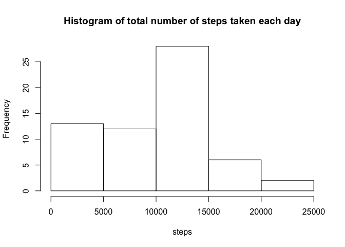
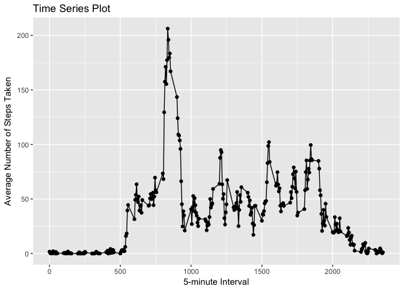
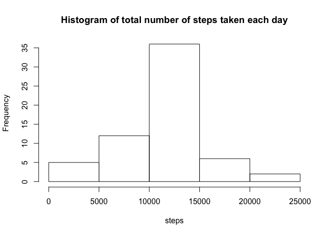
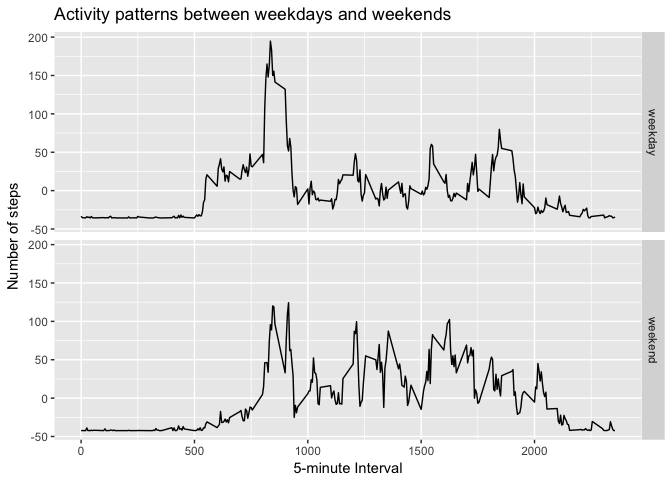

This is the peer assessment 1 for Producible Research Course on Coursera.

### Loading and preprocessing the data


```r
activity_df = read.csv("activity.csv", na.strings = "NA") 
activity_df$date = as.Date(activity_df$date)
activity_df$steps = as.numeric(activity_df$steps)
activity_df$interval = as.numeric(activity_df$interval)
```

### Build histogram of total number of steps


```r
library(dplyr)
total_steps = activity_df %>% group_by(date) %>% summarize(steps_n = sum(steps, na.rm = TRUE))
hist(total_steps$steps_n, main = "Histogram of total number of steps taken each day", xlab = "steps")
```

<!-- -->

```r
mean_steps <- mean(total_steps$steps_n)
median_steps <- median(total_steps$steps_n)
```

Mean Steps: 9354.23

Median Steps: 10395.00

### Calculate the average daily activity pattern


```r
int_df = activity_df %>% group_by(interval) %>% summarise(mean_steps = mean(steps, na.rm = T))
library(ggplot2)
ggplot(data = int_df, aes(x=interval, y=mean_steps)) + geom_point() + geom_line() + labs(title = "Time Series Plot", x = "5-minute Interval", y = "Average Number of Steps Taken")
```

<!-- -->

### Impute missing values


```r
library(dplyr)
NA_count <- sum(is.na(activity_df$steps))
activity_df = activity_df %>% left_join(int_df, by="interval") %>% mutate(steps = if_else(is.na(steps), mean_steps, steps))
total_steps = activity_df %>% group_by(date) %>% summarize(steps_n = sum(steps, na.rm = TRUE))
hist(total_steps$steps_n, main = "Histogram of total number of steps taken each day", xlab = "steps")
```

<!-- -->

```r
mean_steps <- mean(total_steps$steps_n)
median_steps <- median(total_steps$steps_n)
```

Mean Steps with Imputted Data: 10766.19

Median Steps with Imputted Data: 10766.19

Missing data was imputted with the mean number of steps for each interval.

### Discover differences in activity patterns between weekdays and weekends


```r
new_activity_df <- activity_df %>% mutate(wk_day = if_else(weekdays(date) %in% c("Monday","Tuesday","Wednesday","Thursday","Friday"), "weekday", "weekend"))
average_steps_df = new_activity_df %>% group_by(wk_day, interval) %>% summarize(steps_n2 = mean(steps, na.rm = TRUE)) %>% mutate(centered_steps = steps_n2 - mean(steps_n2))
ggplot(data = average_steps_df, aes(x=interval, y=centered_steps)) + geom_line() + labs(title = "Activity patterns between weekdays and weekends", x = "5-minute Interval", y = "Number of steps") + facet_grid(wk_day~.) 
```

<!-- -->
